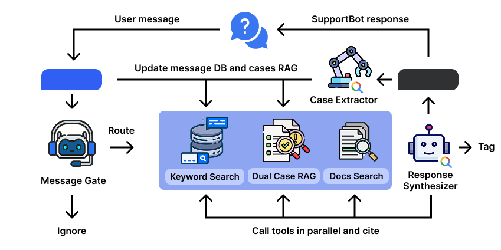

# SupportBot: Dual-RAG Case Mining for Grounded Technical Support

This repository contains the paper, evaluation framework, and benchmark results for SupportBot — a technical support system that continuously mines structured problem-solution cases from community chat streams and retrieves from them to generate grounded responses.

## Paper

**SupportBot: Dual-RAG Case Mining for Grounded Technical Support with the SupportBench Benchmark**

Pavel Shpagin

> We present SupportBot, a technical support system that continuously mines structured problem-solution cases from community chat streams and retrieves from them to generate grounded responses. SupportBot introduces a dual-RAG architecture that separates confirmed solutions (SCRAG) from unconfirmed recommendations (RCRAG), enabling confidence-tiered retrieval with a promotion mechanism. On SupportBench, SupportBot achieves a Score of 7.8/10 with 100% precision and 93% recall, outperforming a chunked-RAG baseline (+35%) while using .

- **Paper PDF**: [`paper/main.pdf`](paper/main.pdf)
- **LaTeX source**: [`paper/main.tex`](paper/main.tex)

## SupportBench Dataset

**60,000 messages** across **6 datasets** in **3 languages** (Ukrainian, Spanish, English), spanning **6 technical domains**. All messages are sourced from public Telegram support groups.

| Dataset | Language | Domain | Messages |
|---------|----------|--------|----------|
| Ardupilot-UA | Ukrainian | UAV / Drones | 10,000 |
| MikroTik-UA | Ukrainian | Networking | 10,000 |
| Domotica-ES | Spanish | Smart Home / HA | 10,000 |
| NASeros-ES | Spanish | NAS / Networking | 10,000 |
| Tasmota-EN | English | IoT Firmware | 10,000 |
| AdGuard-EN | English | Ad-blocking / DNS | 10,000 |

The dataset is hosted on HuggingFace: **[Academia-Tech/SupportBench](https://huggingface.co/datasets/Academia-Tech/SupportBench)**

## Results

SupportBench results on Ardupilot-UA (900 history / 100 live messages):

| System | Score | Quality | Precision | Recall | Cost / 100 msgs |
|--------|-------|---------|-----------|--------|------------------|
| **SupportBot** | **7.8** | **8.4** | **100%** | 93% | **$0.40** |
| Chunked-RAG | 6.3 | 7.2 | 86% | 88% | $0.62 |

- **Score**: quality x recall (0-10)
- **Quality**: mean per-response rating (correctness, helpfulness, specificity, necessity)
- **Precision/Recall**: against LLM-identified ground-truth questions
- All systems use Gemini 2.5 Pro for generation

## Repository Structure

```
paper/
  main.tex              # LaTeX source
  main.pdf              # Compiled paper
  references.bib        # Bibliography
  acl.sty               # ACL conference style

scripts/
  eval_supportbench.py  # Main evaluation runner (offline replay protocol)
  eval_case_server.py   # Case server for evaluation
  eval_debug_answer.py  # Debug individual answers
  eval_synthesizer_comparison.py  # Compare synthesizer variants
  build_supportbench.py           # Build dataset from Telegram exports
  build_supportbench_unified.py   # Unified dataset builder
  upload_supportbench_hf.py       # Upload dataset to HuggingFace
  supportbench_stats.py           # Dataset statistics
  run_all_evals.sh                # Run all evaluations
  run_case_server.py              # Start case server

results/
  eval_ua_ardupilot_supportbot_900.json  # Main result (paper Table 1)
  eval_ua_ardupilot_baseline.json        # LLM baseline
  eval_ua_ardupilot_chunked-rag.json     # Chunked-RAG baseline
  eval_domotica_es_supportbot_v3.json    # Cross-lingual (Spanish)
  eval_tasmota_supportbot_v3.json        # Cross-lingual (English)
  cases_ua_ardupilot.json                # Extracted cases
  *.html                                 # Interactive HTML reports

illustrations/
  architecture.png      # System architecture diagram
  benchmark.png         # Benchmark comparison chart
```

## Running Evaluations

### Prerequisites

```bash
pip install google-generativeai chromadb mysql-connector-python pydantic
```

Set environment variables:
```bash
export GOOGLE_API_KEY=<your-gemini-key>
export MYSQL_HOST=<db-host>  # or use local SQLite mode
```

### Run the main evaluation

```bash
# Start the case server (serves mined cases for retrieval)
python scripts/run_case_server.py

# Run SupportBot evaluation on Ardupilot-UA
python scripts/eval_supportbench.py \
  --dataset datasets/ua_ardupilot.json \
  --mode supportbot \
  --history-split 900 \
  --output results/eval_ua_ardupilot_supportbot.json

# Run baselines
python scripts/eval_supportbench.py \
  --dataset datasets/ua_ardupilot.json \
  --mode baseline \
  --output results/eval_ua_ardupilot_baseline.json

python scripts/eval_supportbench.py \
  --dataset datasets/ua_ardupilot.json \
  --mode chunked-rag \
  --output results/eval_ua_ardupilot_chunked-rag.json
```

### View results

Each evaluation produces a JSON file with per-message scores and an HTML report for interactive browsing.

## Architecture



**Dual-RAG**: Two separate ChromaDB collections — SCRAG (confirmed solutions) and RCRAG (unconfirmed recommendations) — with a promotion mechanism when recommendations are later confirmed.

**Evaluation protocol**: Offline replay that replicates real-time production behavior. History messages are ingested for case extraction, then live messages are processed one-by-one with the full pipeline (gate → case search → synthesizer).

## Citation

```bibtex
@inproceedings{supportbot2026,
  title={SupportBot: Dual-RAG Case Mining for Grounded Technical Support with the SupportBench Benchmark},
  author={Shpagin, Pavel},
  booktitle={Proceedings of EMNLP 2026},
  year={2026}
}
```

## License

- **Code**: MIT License
- **SupportBench dataset**: CC BY 4.0
- All messages are from public Telegram groups with irreversibly anonymized sender identities
